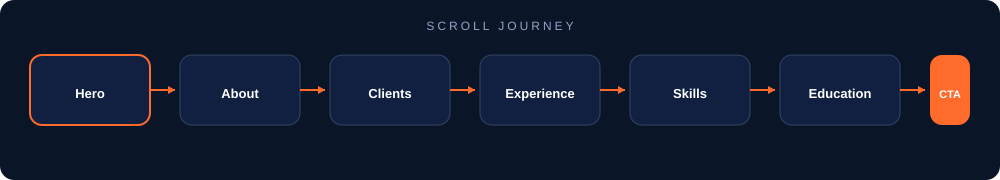
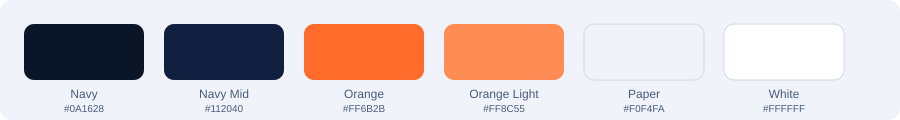

<div align="center">


<br /><br />

### **A bold, single-page portfolio engineered for first impressions**

*Responsive · Self-hosted · Recruiter-ready · Zero CDN lock-in*

<br />

[](https://developer.mozilla.org/en-US/docs/Web/HTML)
[](https://developer.mozilla.org/en-US/docs/Web/CSS)
[](https://developer.mozilla.org/en-US/docs/Web/JavaScript)
[](https://getbootstrap.com/)
[]()
[]()
[](https://abhijeetsinghdevgan.github.io/uzma-hassan-portfolio/)

<br />

[**🌐 Live Site**](https://abhijeetsinghdevgan.github.io/uzma-hassan-portfolio/) · [**⬇ Scroll to Preview**](#-live-preview-mockup) · [**Quick Start**](#-quick-start) · [**Structure**](#-project-structure)

</div>

---

## ✨ Why this stands out

<table>
<tr>
<td width="50%" valign="top">

### 🎯 Built to convert
Sticky nav, hero CTA, resume download, and a dedicated **Hire Me** flow — every section guides visitors toward action.

### 📱 Mobile-first
Hamburger menu, touch-friendly targets, and fluid layouts that look sharp from phone to desktop.

</td>
<td width="50%" valign="top">

### ⚡ Performance-minded
Fonts, icons, CSS, and JS are bundled locally — fast loads, no third-party dependency risk.

### 🎨 Editorial design
Navy + orange palette, Playfair Display headlines, and DM Sans body text for a premium editorial feel.

</td>
</tr>
</table>

---

## 👁 Live Preview Mockup

> *Generic mockup — no personal data shown. Your live site content stays in `index.html`.*

<div align="center">
  
</div>

<br />

<div align="center">
  
</div>

---

## 🧩 Page Sections

| Section | Purpose |
|:--------|:--------|
| **Hero** | Instant positioning + primary call-to-action |
| **About** | Professional summary & highlights |
| **Clients** | Brand credibility at a glance |
| **Experience** | Timeline of roles & impact |
| **Skills** | Technical & soft-skill badges |
| **Education** | Academic background |
| **Contact** | Hire-me form & direct outreach |

---

## 🎨 Design System

<div align="center">
  
</div>

| Token | Value | Usage |
|:------|:------|:------|
| Navy | `#0A1628` | Headings, nav, dark surfaces |
| Orange | `#FF6B2B` | Accents, CTAs, highlights |
| Paper | `#F0F4FA` | Page background |
| Muted | `#4A5A7A` | Supporting text |

---

## 🚀 Quick Start

```bash
# 1. Clone
git clone https://github.com/abhijeetsinghdevgan/uzma-hassan-portfolio.git
cd uzma-hassan-portfolio

# 2. Open locally
start index.html        # Windows
open index.html         # macOS
xdg-open index.html     # Linux
```

No build step. No `npm install`. Just open and go.

---

## 📁 Project Structure

```
uzma-hassan-portfolio/
│
├── index.html                 # Single-page portfolio
│
└── assets/
    ├── css/                   # Bootstrap + custom styles
    ├── js/                    # Interactions & mobile nav
    ├── fonts/                 # DM Sans + Playfair Display
    ├── icons/                 # Favicon
    ├── images/                # Visual assets
    ├── resume/                # Downloadable resume PDF
    └── readme/                # README visuals (this page)
```

---

## 🛠 Tech Stack

```
┌─────────────┬──────────────────────────────────────┐
│  Markup     │  Semantic HTML5                      │
│  Styling    │  Custom CSS + Bootstrap 5            │
│  Icons      │  Font Awesome (local)                │
│  Typography │  Playfair Display + DM Sans (local)  │
│  Scripts    │  Vanilla JavaScript                  │
└─────────────┴──────────────────────────────────────┘
```

---

## 🔒 Privacy Note

This README uses **generic labels and mock visuals only**. Names, employers, clients, and contact details are intentionally omitted from documentation and kept inside the site source files.

---

<div align="center">

<br />

**⭐ If this template helped you, star the repo — it helps others discover it.**

<br />

<sub>Built with HTML · CSS · JavaScript · Bootstrap</sub>

</div>
